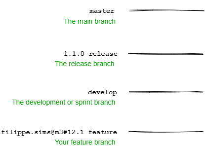

# PGC - Branches

## As branches principais

O repositório central possui dois ramos principais com vida infinita:

- `master` é o branch principal, a HEAD do projeto, nele há somente versões que estão em produção.

- `develop` possui todo código já entregues e as últimas implementações de desenvolvimento para a próxima versão. Quando o código do branch develop é considerado estável e pronto para ser implantado, todas as alterações devem ser mescladas de volta para o branch master e criada uma tag.

- `documentation` é a branch paralela à branch master que será utilizada para documentação.

## As branches de suporte

- `feature branches` são branches de melhoria que serão utilizadas para desenvolver novas funcionalidades.

  - Será utilizado o modelo de requisitos para representar cada funcionalidade.

  - Branches de melhorias são usados para desenvolver novas funcionalidades para o próximo lançamento. Em excência, um branch de melhoria existe apenas enquanto está em desenvolvimento, devendo ser mesclado ao branch develop, assumindo que entrará no próximo lançamento, ou descartado caso não seja útil ou seja um experimento.

        Deve ser criado a partir da:
                - develop

        Deve ser mesclado de volta para:
                - develop

        Convensão de nome: feature/nome.sobrenome@id-requisito
        
        Exemplo: feature/jose.augusto@m3#12.1 (branch criada por "José Augusto" referente ao requisito "m3#12.1")

  - `02-1_feature-branches.md` contém informações mais detalhadas e apresenta tutorial de criação e finalização de release branches

- `release branches` são branches de lançamento que serão usadas para preparação do lançamento da próxima versão de produção. 
  - Nele são permitidas pequenas correções e atualização de versão nos arquivos. Fazendo isso no branch de lançamento, o branch develop fica livre para receber novas melhorias para a próxima versão.
  - Na criação do branch de lançamento é decidido qual versão o projeto terá, até este momento o branch develop reflete as alterações da próxima versão, independende de qual for. Esta decisão é feita na criação do branch de lançamento e segue as convensões de versionamento do projeto.

        Deve ser criado a partir da:
                - develop
        
        Deve ser mesclado de volta para:
                - develop e master
        
        Convensão de nome: release/MAJOR.MINOR.PATCH

  - `02-2_release-branches.md` contém informações mais detalhadas e apresenta tutorial de criação e finalização de release branches.

- `hotfix branches` são branches de correções que se assemelham à branches de lançamentos em sua concepção, pois tem o mesmo objetivo de prepara uma versão para produção, embora não planejada. 
  - Eles surgem da necessidade de agir imediatamente em uma versão de produção já implantada. 
  - Quando um bug crítico ocorre em produção um branch de correção precisa ser criado a partir da tag correspondente.
  - A ideia é que o time que está trabalhando na próxima versão no branch develop possa continuar enquanto alguém prepara uma correção.

        Deve ser criado a partir da:
                - master
        
        Deve ser mesclado de volta para:
                - develop e master
        
        Convensão de nome: hotfix/*

  - `02-3_hotfix-branches.md` contém informações mais detalhadas e apresenta tutorial de criação e finalização de hotfix branches.

# Tags

O Git tem a habilidade de marcar pontos específicos na história como sendo importantes. Utilizaremos essa funcionalidade para marcar pontos onde foram feitas releases.

## Release Tags

A definição de Releases Tags será realizada na branch master, no qual será realizado incremento no número de versão a partir de merges de `release branches` ou `hotfix branches`.

Um número de versão tem três componentes, `major.minor.patch`, por exemplo 1.2.13. Você decide o que incrementar com base nas alterações feitas desde a última versão (v1.0 e assim por diante).

- `patch` é para pequenas alterações ou correções de bugs
- `minor` é para novas funcionalidades
- `major` é para grandes mudanças, como uma reescrita do projeto

Se você incrementar um componente superior, zera os inferiores, então 1.2.13 se tornaria 1.2.14 com um aumento de versão de patch, 1.3.0 com um aumento de versão menor e 2.0.0 com um aumento de versão principal.

# Diagrama de exemplo

---